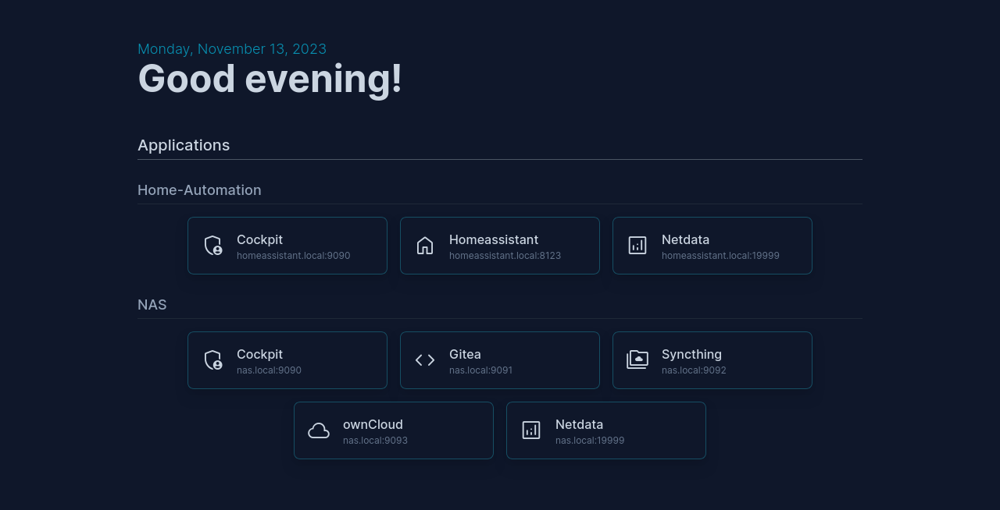

# Dashboard

A very basic homelab dashboard, allowing you to display links to all your services on one simple page.
Configured via yaml.
No fancy stuff, no other extras.

## Preview



## Instructions

### Pre-built Docker container

A pre-built docker container is available at `ghcr.io/qzed/dashboard:latest`.
You can pull and run it via
```
docker container run --rm \
    -p 80:3000/tcp \
    --mount type=bind,source=$CONFIG_DIR,destination=/app/data \
    localhost/dashboard:latest
```
Change the port mapping and mount options to your needs and replace `$CONFIG_DIR` with a path to the configuration directory containing the `apps.yaml` file.

To test it, you can set `$CONFIG_DIR` to the [`data`](data) directory of this repository.
This contains an example app configuration file ([`data/apps.yaml`](data/apps.yaml)), that you can copy and adapt to your setup.
See [below](#configuration) for more details on how to configure the dashboard.

<details>
<summary>Example pod specification</summary>

```yaml
apiVersion: v1
kind: Pod

metadata:
  name: dashboard
  labels:
    app: dashboard

spec:
  containers:
  - name: dashboard
    image: ghcr.io/qzed/dashboard:latest

    ports:
    - containerPort: 3000
      hostPort: 80
      protocol: tcp

    volumeMounts:
    - name: data
      mountPath: /app/data

  volumes:
  - name: data
    hostPath:
      path: /srv/containers/dashboard/data
      type: Directory
```

</details>

### Build and run via Docker

Build the container with
```
docker build -f Dockerfile -t dashboard
```
then run it via
```
docker container run --rm \
    -p 80:3000/tcp \
    --mount type=bind,source=$PWD/data,destination=/app/data \
    localhost/dashboard:latest
```
Change the port mapping and mount options to your needs.
When running via Docker, the app runs in `/app` and expects the `apps.yaml` configuration file at `/app/data/apps.yaml`.

### Build and run from source (without Docker)

To build and run from source, run
```
yarn install
yarn build
yarn run
```
To debug and develop, run
```
yarn dev
```

## Configuration

The list of displayed applications/services is placed at `$CWD/data/apps.yaml`, where `$CWD` indicates the current working directory of the server process.
An example configuration that will be used when you run with the above example commands (as-is) can be found at `data/apps.yaml`.

Each app entry can be configured via the following properties:
- `name`: Main display name
- `text`: Smaller additional text (this could, for example, display the URL)
- `url`: The URL to link to
- `icon`: The icon to display. A list of supported icon names can be found [here](https://marella.me/material-symbols/demo/#rounded).
